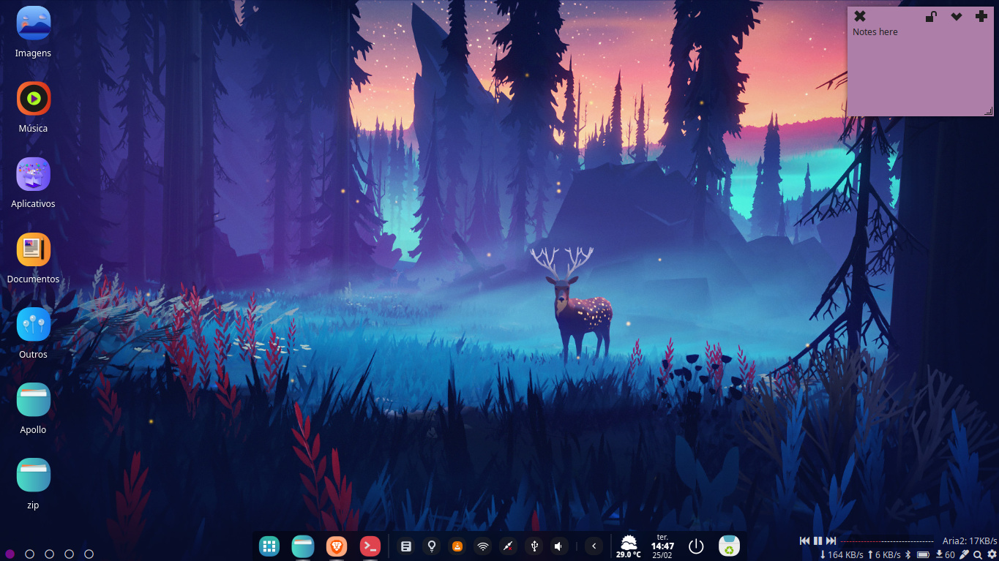
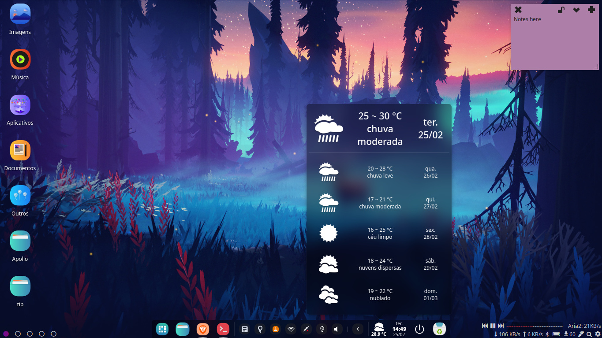
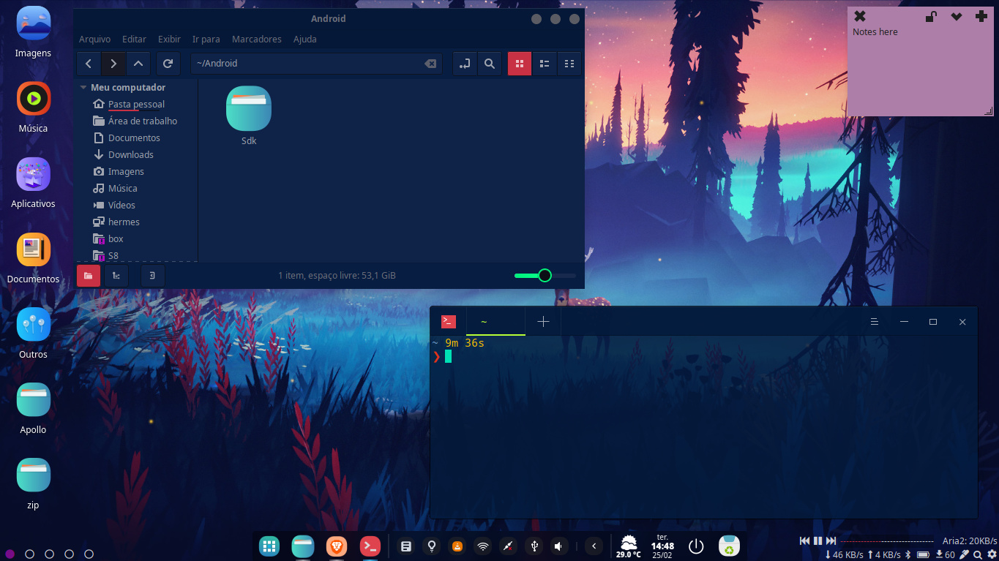
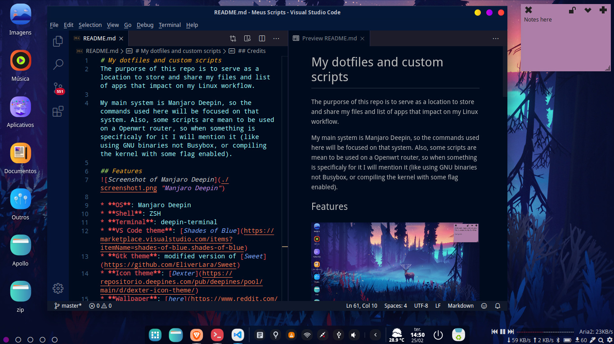
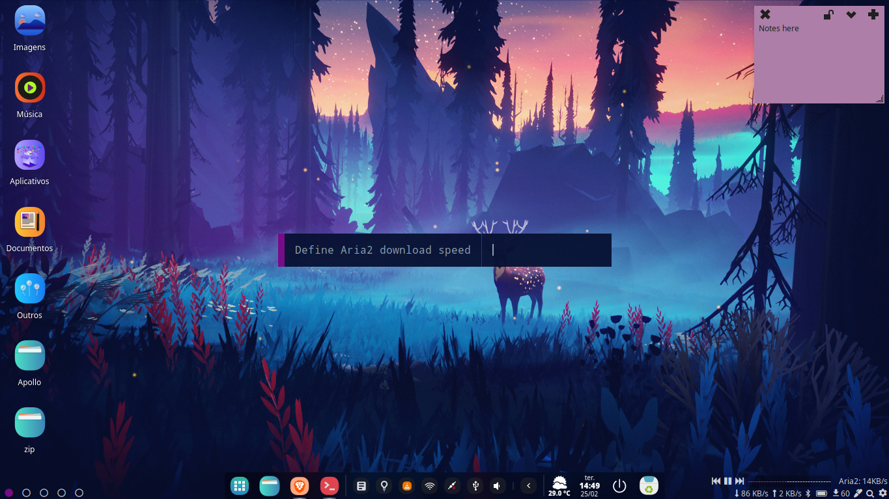

# My dotfiles and custom scripts
The purporse of this repo is to serve as a location to store and share my files and list of apps that impact on my Linux workflow.

My main system is Manjaro Deepin, so the commands used here will be focused on that system. Also, some scripts are mean to be used on a Openwrt router, so when something is specificaly for it I will mention it (like using GNU binaries not Busybox, or compiling the kernel with some flag enabled).

## Features

* **OS**: Manjaro Deepin
* **Shell**: ZSH
* **Terminal**: deepin-terminal
* **VS Code theme**: [Shades of Blue](https://marketplace.visualstudio.com/items?itemName=shades-of-blue.shades-of-blue)
* **Gtk theme**: modified version of [Sweet](https://github.com/EliverLara/Sweet)
* **Icon theme**: [Dexter](https://repositorio.deepines.com/pub/deepines/pool/main/d/dexter-icon-theme/)
* **Wallpaper**: [here](https://www.reddit.com/r/wallpapers/comments/a07imq/among_trees_1920x1080/)
* **Notes on desktop**: indicator-stickynotes
* **Infos on the lower sides**: polybar
    - That only works if you set the Deepin dock to always display. If not, you probably should adapt the config of polybar to use a unique bar at the top of the screen.
* **Polybar plugins**:
  - Aria2 download speed indicator, and on click lets you change the speed via Rofi
  - Vlc player control
  - Workspace indicator
  - Network traffic (change the interfaces on the config file)
  - Bluetooth indicator and toggler
  - Battery status
  - Pacman and AUR updates indicator
  - Gedit shortcut (a lot of times I need to paste some text just to not lose it, as I prefer to not use clipboard managers)
  - Assistant shorcut that launches Albert
  - Deepin control center shorcut

* **Modified Deepin dock**:
  - Set icon size via terminal to 28
  - Removed the power charging plugin to save screen space since I put one smaller battery indicator on the polybar.
  - The orignal fashion mode of the clock is VERY ugly, so I adapted it to a more beatyful one. 
  - Slightly modified version of a weather plugin for the dock, with the icon smaller and the text more to the bottom.
  - The shutdown button on the fashion mode are modified to display the same icon as in eficient mode.

### Dependencies
* zsh, wget, curl and grep, navi, playerctl, jq
    - zsh dependencies:
       - zsh-sintax-highlighting
       - zsh-syntax-highlighting
       - zsh-autosuggestions
       - autojump
* [Albert](https://github.com/albertlauncher/albert) - For launcher assistant
* [Rofi](https://github.com/davatorium/rofi) - dmenu like, used as a input window (can replace Albert as an assistant too)
* [Aria2p](https://pypi.org/project/aria2p/) - for Aria2c remote control  
    - Install with "**pip install "aria2p[tui]"**" 

## Credits
Polybar config was based on https://github.com/crnihr/dotfiles/

.zshrc and aliases based on https://www.christitus.com/zsh/ which uses https://github.com/sindresorhus/pure