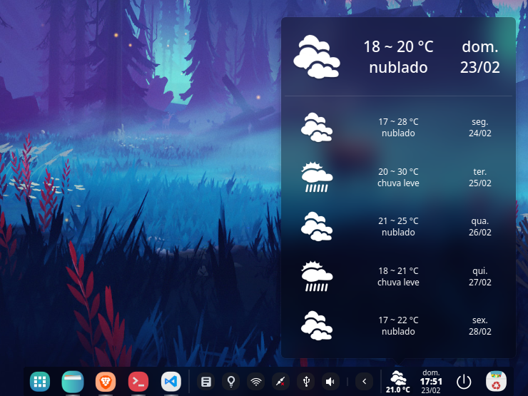
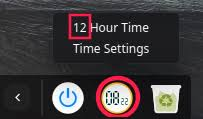
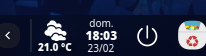

# About

## Deepin dock (dde-dock)

I made some modifications on the Deepin dock:
* **Custom dock size**  
        Defined custom icon size using:  
> gsettings set com.deepin.dde.dock icon-size 28

* **The power off icon**  
        In the oficial dock, when the fashion mode is on the icon would be the one from folder "status" provided by the icon theme. I prefer to use the same icon used in the eficient mode, from folder "actions" of the icon theme.
* **The clock plugin**  
        I really dislike the clock of the fashion mode. 
                   
        So I made some changes to the oficial clock so do it becomes this:  
          
        Or if you prefer something more customizable, you can take a look at [this plugin](https://github.com/v-svg/dde-dock-clock)
* **The weather plugin**  
        There is a weather plugin [here](https://github.com/v-svg/dde-dock-weather). I made some changes in it too. Made the icon smaller and put the text at the bottom.
* **The power indicator at the tray**  
        Since we have a power indicator on the bar, I disabled the one from the dock tray.

To disable some plugin, just move it from "/usr/lib/dde-dock/plugins" to another folder.

To install the modded power off, clock and weather, you can:
* Copy the files in "pre build" to "/usr/lib/dde-dock/plugins"
* Get the source of the Deepin Dock and the Weather plugin, replace the files from the ones in "src", and build.

Then, restart dde-dock:

> killall dde-dock

Remember, the "pre build" files and the used "src" files are from those versions:
* dde-dock release 5.0 on Github repo
* dde-dock-weather from commit c2f7879

**If you use the pre build or replaces the src with  another version, it might not work.**