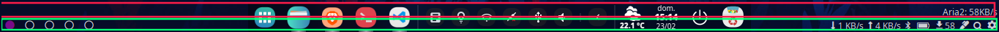
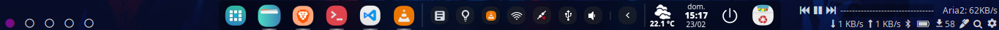

# About

## Polybar
The polybar is configured to two bars, one at the top of the other, both on the lower side of the screen:

### Dependencies
* **playerctl** to control Vlc via polybar module
* **Rofi** for the input window on click on Aria2 speed
* **Albert** for the assistant on click on the search icon (you can just use Rofi for this too, if prefer)

### To-do
* Change player module from playerctl to inter process messaging (maybe is more performatic?)
* Sometimes you cannot click on the Deepin Dock because of the bars. Then, to decrease the number of times this happens, the bars are set to the take the size of the dock - 2 pixels. But, the click problem still happens sometimes. Maybe change to 3 separate bars that do not overlay the dock?
* Deepin v20 dock will take almost all the width of the screen. If it cannot me modified, transform the bars to one top bar.
* Removing the tray from the dock and put it on the polybar would save a lot of screen space, allowing more apps to be open without the dock becoming too large. But others applications cannot control the tray, since the process dde-desktop controls it even when the dock is disabled.